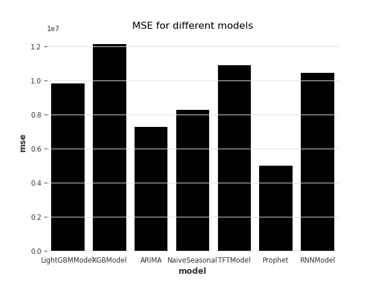
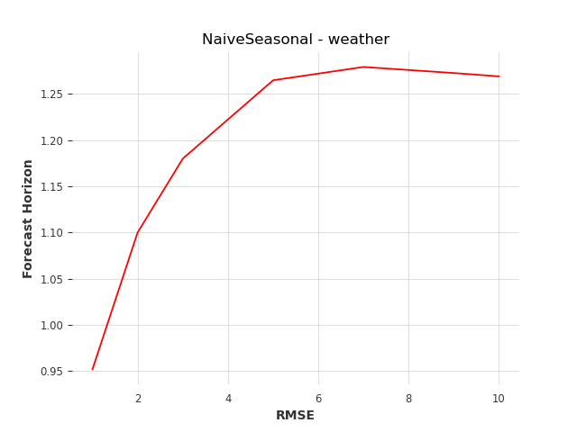
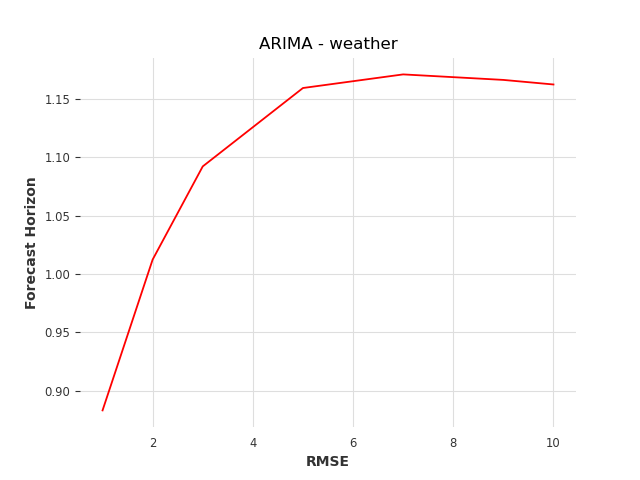
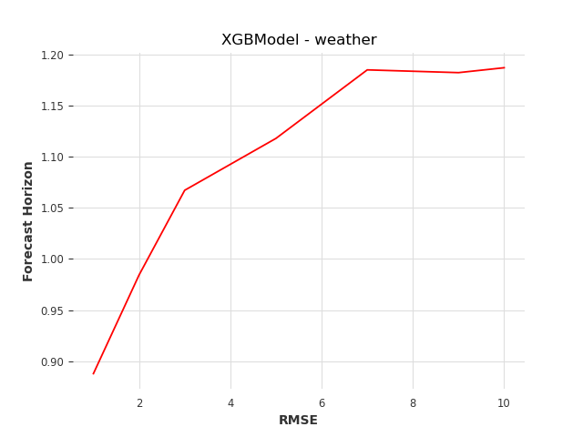

# Predicting the Future: A Comparison of Modern TimeSeries Models

## Introduction

Navigating the world of TimeSeries prediction models can be a maze. With numerous leading-edge models at play, knowing which offer the best predictive performance, require the least parameter tuning, and thrive under certain conditions, is invaluable. This post demystifies that maze. We'll put several state-of-the-art models head-to-head, testing them against three disparate datasets, to provide clear, practical insights that guide in selecting the right tool for your TimeSeries prediction needs. Strap in and join us on this data-driven journey!

## Datasets

### Walmart Sales Forecasting

The dataset employed for this study was sourced from the [Kaggle competition - Walmart Sales Forecasting](https://www.kaggle.com/competitions/walmart-recruiting-store-sales-forecasting), with our focus centered on predicting sales for one select store and one particular department. The dataset encapsulates weekly sales data for each store complimented with several prominent features, among which, we have strategically chosen to engage with the ones listed below:

Past Covariates:

- **Temperature** - Represents the average regional temperature
- **Fuel_Price** - Indicates the regional cost of fuel
- **CPI** - Outline of the Consumer Price Index
- **Unemployment** - Denotes the regional unemployment rate

Future Covariate:

- **IsHoliday** - Specifies if a given week is a special holiday week (This feature is known in the future)

We subsequently partitioned this dataset, creating distinct training and test sets for our analysis.

### Eletricity Consumption Forecasting

The Electricity Consumption Forecasting dataset was sourced from the [Kaggle](https://www.kaggle.com/datasets/uciml/electric-power-consumption-data-set). This dataset contains 2075259 measurements gathered between December 2006 and November 2010 (47 months).

The dataset contains some missing values in the measurements, accounting for nearly 1.25% of the rows. Despite these missing values, all calendar timestamps are present in the dataset. - We've decided to interpolate the missing values to maintain the integrity of the dataset.

Attribute Information:

- **date**: Date in the format `dd/mm/yyyy`.
- **time**: Time in the format `hh:mm:ss`.
- **global_active_power**: Household global minute-averaged active power (in kilowatts).
- **global_reactive_power**: Household global minute-averaged reactive power (in kilowatts).
- **voltage**: Minute-averaged voltage (in volts).
- **global_intensity**: Household global minute-averaged current intensity (in amperes).
- **sub_metering_1**: Energy sub-metering No. 1 (in watt-hours of active energy), corresponding to the kitchen, which primarily houses a dishwasher, an oven, and a microwave (note: hot plates are gas-powered).
- **sub_metering_2**: Energy sub-metering No. 2 (in watt-hours of active energy), representing the laundry room, which includes a washing machine, a tumble dryer, a refrigerator, and lighting.
- **sub_metering_3**: Energy sub-metering No. 3 (in watt-hours of active energy), associated with an electric water heater and an air conditioner.

The dataset was split into training and test sets. The data didn't need to be normalized, as the values were already in the same range.
The dataset was big - so big actually that training the models took a considerable amount of time.
The data was resampled to hourly data to reduce the size of the dataset.

### Bitcoin Price Forecasting

// TODO: List the datasets, explain why each dataset is different

### World War Two Weather Conditions

This dataset contains daily weather summaries for 162 various stations around the world, during Wold War Two (years 1940 - 1945).
In our experiments we have resorted to using the mean daily temperature for the Wheeler Army Airfield, located in Hawaii, due to the biggest amount of data being present in the dataset.

Attribute Information (narrowed down to the most essential attributes):

- **STA**: Weather Bureau Army Navy number, corresponding to an individual station
- **Date**: Date in format `yy-mm-dd`
- **Precip**: The precipitation of a station
- **MaxTemp**: Highest temperature measured on a certain day
- **MinTemp**: Lowest temperature measured on a certain day
- **MeanTemp**: Mean temperature measured

## Models

// TODO: List models, table the results

### Baseline - Naive Seasonal Model

For our baseline model, we have chosen to utilize the [NaiveSeasonal model](https://unit8co.github.io/darts/generated_api/darts.models.forecasting.baselines.html#darts.models.forecasting.baselines.NaiveSeasonal). This model always predicts the value from $K$ time steps ago. We set $K=1$, so in this case, the model predicts the last value of the training set.

### Extreme Gradient Boosting (XGBoost)

One of the most common solutions for for machine learning tasks is a library called [XGBoost](https://github.com/dmlc/xgboost), which is designed for efficient and flexible gradient boosting. In this experiment we have resorted to using the [implementation provided by the darts library](https://unit8co.github.io/darts/generated_api/darts.models.forecasting.xgboost.html#darts.models.forecasting.xgboost.XGBModel).

The model performed exceptionally wel in our testing, proving to be the best or second best model in the datasets, that we have experimented with.

### Autoregressive integrated moving average (ARIMA)

A popular and widely used statistical method for time series forecasting is the ARIMA model, which stands for AutoRegressive Integrated Moving Average. In our experiments we used [this implementation](https://unit8co.github.io/darts/generated_api/darts.models.forecasting.arima.html).

According to our tests, this model proved to be one of the best from all of the considered solutions.

### TimeGPT

We decided to put the cutting-edge TimeGPT model to the test. A transformer-based model tailored for TimeSeries forecasting, TimeGPT is a variant of the widely appreciated GPT model, known for its efficacy in the Natural Language Processing (NLP) domain. We ran a series of tests using the Electricity Consumption Forecasting dataset as our playground.

However, the outcome was less than impressive. Not only did the performance fail to meet our expectations, but the cost linked to it was also quite high. The free trial, which amounts to a hefty sum of $1000, was almost entirely consumed during these tests. Consequently, due to its prohibitive price and underwhelming performance, the TimeGPT model was eliminated from our final comparison.

## Comparison

We have presented a table below that encapsulates the outcomes of our data analysis. This presentation aims to offer a lucid depiction of each model's performance when applied to three diverse datasets.

### Mean Squared Error (MSE) Scores of one step ahead predictions

|          | Electricity | Walmart Sales | Bitcoin | WW2 Weather |
|----------|-------------|---------------|---------|-------------|
| Baseline | 0.0075      | 30.5M         |         | 0.9062      |
| XGBoost  | 0.0086      | **5.82M**     |         | 0.7882      |
| LightGBM | 0.0077      | 11.89M        |         |             |
| Prophet  | 0.0800      |               |         |             |
| Arima    | 0.0067      | 35.58M        |         | 0.7801      |
| TFT      | X           | 26.97M        |         |             |

#### Electricity:

#### WW2 Weather:

#### Walmart Sales Forecasting

## Time horizons
When considering a model for predicting time series data, it's important to take it's long-term prediction performance into consideration.
Therefore we have prepared a comparison of the models' performance with time horizons ranging from 1 to 10 steps ahead:

### Electricity dataset
| Naive model                                               | ARIMA | XGBoost |
|-----------------------------------------------------------|-------|---------|
|  |       |         |

### WW2 Weather dataset
| Naive model                                               | ARIMA | XGBoost |
|-----------------------------------------------------------|-------|---------|
|  |       |         |

## Conclusion

// TODO: Summarize the results, provide recommendations
